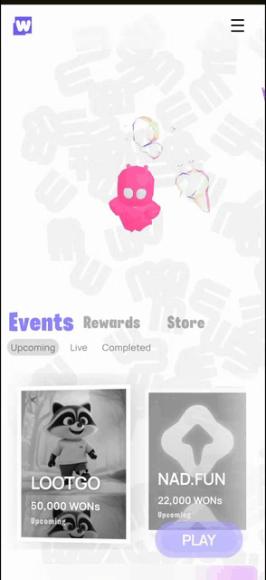
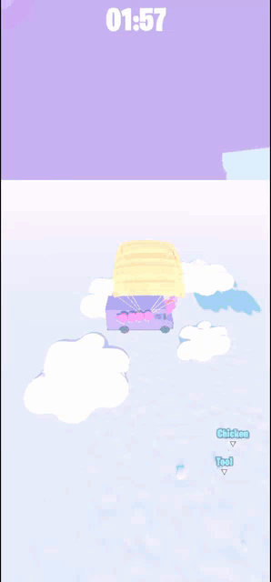
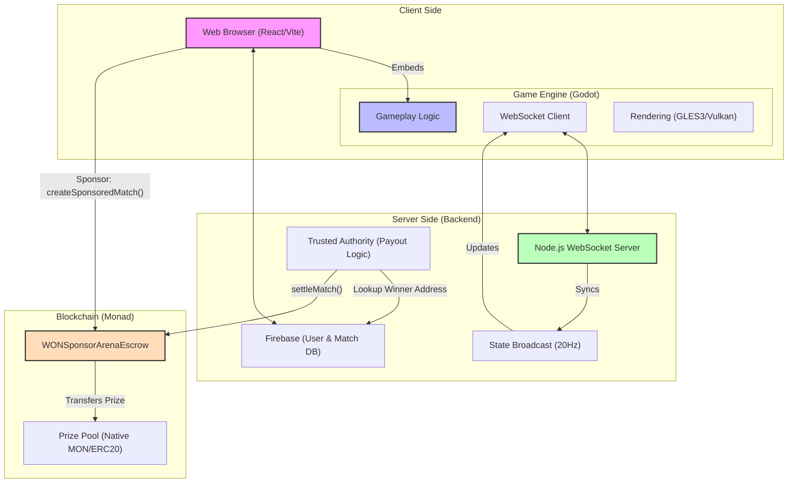

<p align="center">
  
</p>

<h1 align="center">World of Nads (WONs)</h1>
<p align="center">
  World of Nads is a real-time, browser-based multiplayer arena game that combines fast, chaotic gameplay with on-chain settlement using Monad.
  This project explores how to build mass-market games where blockchain is invisible to the player but critical for fairness, ownership, and payouts.
</p>
---
<div style="display:flex; overflow-x:auto; gap:12px; padding:10px 0;white-space: nowrap;">


    
   
  
  
  
  
</div>
---


## 🎮 What the Game Is

- 20-player competitive arena
- Objective-based “king of the hill” style matches
- 1–5 minute rounds designed for high retention
- No pay-to-win mechanics
- Cosmetic-only progression

Think: tag + battle royale pressure, optimized for short, replayable sessions.


## 🎮 Features

- **20-player competitive arena**: High-stakes "King of the Hill" gameplay.
- **Real-time Synchronization**: Node.js backend @20Hz for low-latency state.
- **On-chain Payouts**: Verified winners receive rewards directly to their Monad wallets.
- **Embedded Wallets**: Seamless social login (Privy) with automatically created EVM wallets.
- **Sponsor Tools**: Create and fund matches directly from the dashboard.

---

## 🧠 Architecture Philosophy

- **Gameplay first** (Nintendo model)
- **Cosmetics, not power** (Fortnite model)
- **Blockchain as backend**, not gameplay loop

### System Architecture



- **Client:** Godot Engine (Exported to WASM) embedded in a React/Vite wrapper.
- **Servers:** Node.js WebSocket server for real-time state synchronization.
- **Smart Contracts (Monad):**
  - **Match Escrow:** `0x5EA4AAfa6d8da9F9C0556C0A99F79c39F1Ae7D6b`
  - Handles trustless prize deposits and automated winner payouts.
- **Sponsor Dashboard:** 
  - On-chain match creation with native MON or ERC20 tokens.
  - Transparent prize tracking and cancellation logic.

---

## 🧾 Audit & Docs

- See `audit/README.md` for quick audit notes, manual checks, known limitations, and next steps.
- Contract addresses and settlement notes are tracked alongside the audit notes for reviewer clarity.
- This is a lightweight, pre-release review, not a professional audit.

---

## 📡 Live Events Stream

The game now includes a dedicated events stream for lightweight activity logs.

- **Live WebSocket endpoint:** `wss://worldofnads.onrender.com/events`
- **Local fallback endpoint:** `ws://localhost:8080/events`
- **HTTP snapshot endpoint:** `https://worldofnads.onrender.com/events` (`GET`)
- **History size:** last `100` events (server-side ring buffer)

### Payloads

- `events_snapshot`: sent on connect and via `GET /events`
- `event`: pushed in real time to `/events` subscribers

Example event object:

```json
{
  "id": 12,
  "eventType": "chicken_picked",
  "message": "a1b2c3d4 picked the chicken",
  "playerId": "a1b2c3d4-xxxx-xxxx-xxxx-xxxxxxxxxxxx",
  "timestamp": "2026-03-07T20:00:00.000Z",
  "meta": { "item": "chicken", "action": "pick" }
}
```

### In-game integration

- Godot scene `gameplay2d.tscn` mounts `scripts/Events.gd` as the events bridge.
- `Main.gd` emits `client_event` messages (e.g. player joined, chicken picked/dropped).
- `Events.gd` renders recent status lines in HUD and shows live/local connection status.


---
## 🛠 Tech Stack & Highlights

- **Frontend / Engine:** Godot → WASM embedded in React/Vite  
- **Networking:** Node.js WebSocket server @20Hz + `/events` WebSocket stream  
- **Persistence:** Firebase for cosmetic state  
- **Blockchain:** Monad smart contracts for match settlement + payouts  
- **Gameplay:** 20-player arenas, 1–5 minute rounds, competitive balance  
- **Key focus:** Fast, replayable, low-latency gameplay with trustless settlement
---

## 🔐 Why Blockchain Is Used Here

- Trustless settlement for competitive matches
- Instant payouts after match completion
- Proof-of-skill instead of airdrops or farming
- Bot-resistant distribution via real gameplay

Players don’t need to “understand crypto” to play.

---
## 👨‍💻 My Role

- Full-stack implementation: React + WASM Godot + Node.js  
- Real-time networking, state synchronization, and game physics  
- Blockchain integration for settlement + tournament payouts  
- Systems architecture & performance optimization  
- Gameplay and UX design for high retention
---

## 🚧 Status

- **Monad Mainnet/Devnet Settlement Logic**: [COMPLETE]
- **Sponsor Escrow System**: [LIVE]
- **Live browser build (closed beta)**: Active testing cohort.


---

## 🧾 Audit & Docs

- A lightweight, pre-release audit has been performed; see `audit/README.md` for:
  - Quick audit notes and manual gameplay checks
  - Known limitations and next steps
  - Contract addresses and settlement logic
- This is **not a professional audit**; critical issues are tracked in `audit/security_issues.md` with status updates.
- We continue to patch and harden the system, but the current live demo is fully playable and supports on-chain prize settlement.
