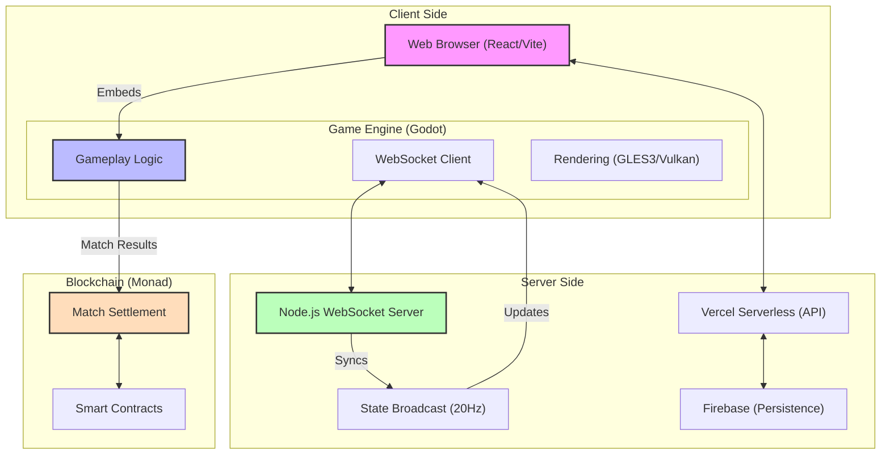

# 🌍 World of Nads (WONs)

**World of Nads** is a real-time, browser-based multiplayer arena game that combines fast, chaotic gameplay with on-chain settlement using Monad.

This project explores how to build **mass-market games** where blockchain is invisible to the player but critical for fairness, ownership, and payouts.

---

## 🎮 What the Game Is

- 20-player competitive arena
- Objective-based “king of the hill” style matches
- 1–5 minute rounds designed for high retention
- No pay-to-win mechanics
- Cosmetic-only progression

Think: tag + battle royale pressure, optimized for short, replayable sessions.

---

## 🧠 Architecture Philosophy

- **Gameplay first** (Nintendo model)
- **Cosmetics, not power** (Fortnite model)
- **Blockchain as backend**, not gameplay loop

### System Design

- **Client:** Godot Engine (Exported to WASM) embedded in a React/Vite wrapper.
- **Servers:** Node.js WebSocket server for real-time state synchronization.
- **Chain (Monad):**
  - Match settlement
  - Tournament payouts
  - Ownership & cosmetic state

Real-time gameplay stays off-chain. Only outcomes that require trust go on-chain.

---

## 🔐 Why Blockchain Is Used Here

- Trustless settlement for competitive matches
- Instant payouts after match completion
- Proof-of-skill instead of airdrops or farming
- Bot-resistant distribution via real gameplay

Players don’t need to “understand crypto” to play.

---

## 🚧 Status

- Live browser build (closed beta)
- Active testing cohort
- Ongoing iteration on gameplay, networking, and settlement logic

---

## 🎯 Why This Project Exists

World of Nads is not a token demo or a play-to-earn experiment.

It’s a systems project:
**how to build fast, competitive games that use blockchain only where it actually adds value.**
