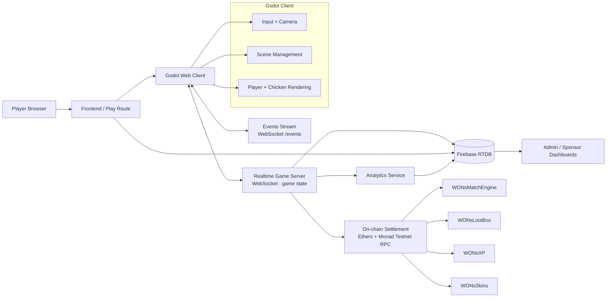
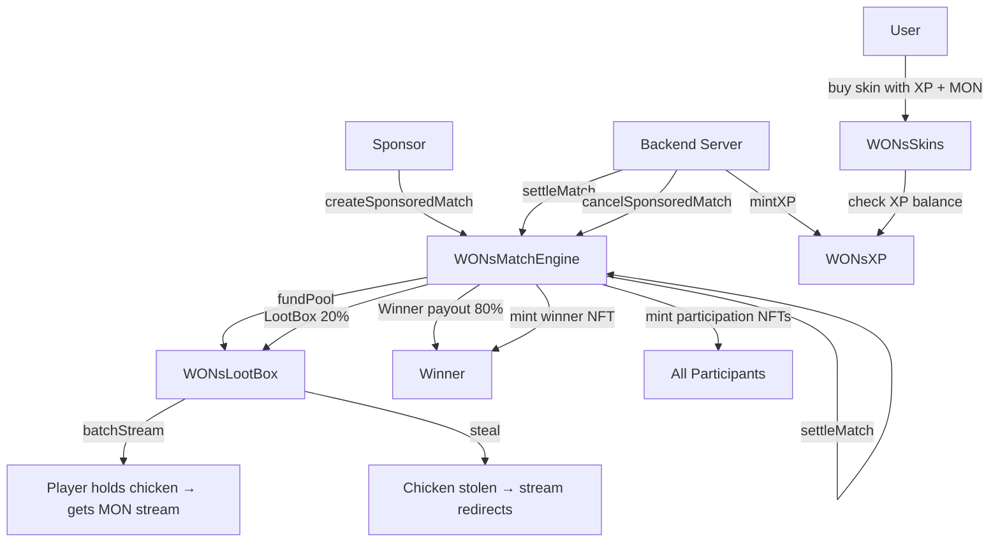
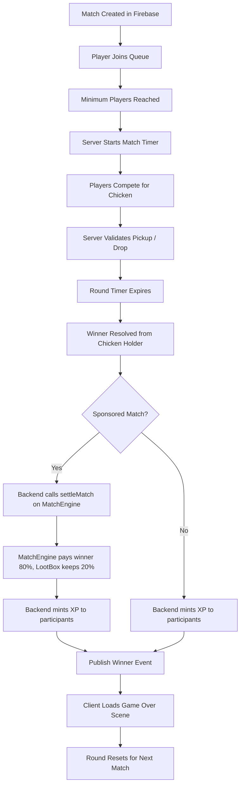

# World of Nads Architecture

## Purpose

World of Nads is a real-time multiplayer arena game built around a server-authoritative match loop, a Godot client, Firebase-backed match and user data, and on-chain settlement on **Monad Testnet (chainId 10143)**.

This document describes the current runtime architecture — every path, service, contract, and env var.

## Network

| Setting | Value |
|---------|-------|
| Chain | Monad Testnet |
| Chain ID | `10143` (hex `0x279F`) |
| RPC | `https://testnet-rpc.monad.xyz` |
| Explorer | `https://testnet.monadexplorer.com` |
| Native currency | MON |

---

## High-Level System

```
Player Browser  ──>  Frontend (React + Privy)  ──>  Godot Web Client
                          │
                          ├──> Backend WS (game server)
                          ├──> Backend HTTP (analytics, admin)
                          ├──> Firebase RTDB (matches, users, rewards)
                          └──> On-chain (Monad Testnet)
                                  ├── WONsMatchEngine
                                  ├── WONsLootBox
                                  ├── WONsXP
                                  └── WONsSkins
```

- The browser app passes `username`, `skin`, and optional `matchId` to the Godot client.
- The Godot web client connects to the realtime game server over WebSocket.
- The backend owns authoritative game state, validates movement, resolves chicken mechanics, and broadcasts state deltas.
- Firebase stores match metadata, user wallets, rewards, roles, and analytics.
- **On-chain settlement** uses four deployed contracts on Monad Testnet.

---

## Architecture Diagram



---

## Deployed Contracts (Monad Testnet)

| Contract | Address | Role |
|----------|---------|------|
| **WONsMatchEngine** | `0xe94d3E317763758689DCc62DC28fBe269a1f177C` | Creates/settles/cancels sponsored matches, mints winner/participation NFTs (ERC-1155) |
| **WONsLootBox** | `0x4c0823A6D61ADc5d38BA976eb50800c84127f7bf` | Holds prize MON, streams to chicken holders during round, settles remainder to winner |
| **WONsXP** | `0x0CD0bfdFE9562e4A71Bd56182981426b09F91E4` | Soulbound ERC-20 XP token — minted by backend for match participation, cannot be transferred |
| **WONsSkins** | `0xaa3F5Cf26403F0EF88ef7fF34Bb015ab76783E86` | ERC-1155 skin marketplace — buy skins with XP + MON, burn to upgrade |

**Authority**: The backend server wallet (`0x37674EE795f126BC933Dc57439eb194889dA0d0E`) is set as `trustedAuthority` on MatchEngine and `minter` on XP token.

---

## Contract Interactions



### Match lifecycle (on-chain)

1. **Sponsor** calls `createSponsoredMatch` on MatchEngine — sends MON prize + 20% lootbox pool.
2. MatchEngine forwards lootbox share to LootBox contract via `fundPool`.
3. During the match, the LootBox streams MON to whoever holds the chicken (`batchStream`).
4. On chicken steal, `steal()` redirects the stream to the new holder.
5. When the round ends, the **backend** calls `settleMatch`:
   - 80% of prize goes to winner.
   - 20% stays in LootBox (distributed by streaming).
   - Winner + participants get ERC-1155 participation/winner NFTs.
6. The backend calls `mintXP` on XP token for all participants.

---

## Backend

Entrypoint: [`backend/index.js`](./backend/index.js)

### HTTP endpoints

| Route | Method | Purpose |
|-------|--------|---------|
| `/` | GET | Health check |
| `/events` | GET | Snapshot of recent in-game events |
| `/analytics/events` | POST | Store analytics event |
| `/analytics/summary` | GET | Aggregated KPIs |
| `/analytics/timeseries` | GET | Time-series metrics |
| `/analytics/export` | GET | Export as JSON/CSV |
| `/admin/verify-access` | POST | Admin access code check |
| `/admin/update-user-roles` | POST | Update Firebase user roles |

### Realtime game authority (WebSocket)

- Player join/disconnect
- Position/rotation validation (clamped max speed)
- Chicken pickup, steal, drop (distance-checked)
- Match countdown and round resets
- Compact `state_delta` broadcasts + periodic full snapshots
- Event publication for `/events` stream

### On-chain settlement module

[`backend/contractClient.js`](./backend/contractClient.js) wraps all four contracts:

| Function | Contract | Purpose |
|----------|----------|---------|
| `createMatchOnchain` | MatchEngine | Sponsor creates a match with prize |
| `settleMatchOnchain` | MatchEngine | Backend settles winner + participants |
| `cancelMatchOnchain` | MatchEngine | Cancel a pending match |
| `mintXP` | XPToken | Backend mints XP to players |
| `batchStreamMON` | LootBox | Stream MON to chicken holder |
| `lootBoxSteal` | LootBox | Redirect stream on steal |
| `getPoolValue` | LootBox | Check remaining lootbox pool |
| `getSkinData` | Skins | Read skin metadata |
| `getAllSkins` | Skins | List all available skins |
| `getXPBalance` | XPToken | Check a player's XP balance |
| `getSkinBalance` | Skins | Check skin ownership |

### Integrations

- [`backend/firebaseClient.js`](./backend/firebaseClient.js) — Firebase RTDB
- [`backend/contractClient.js`](./backend/contractClient.js) — Ethers + Monad testnet RPC
- [`backend/analyticsService.js`](./backend/analyticsService.js) — Analytics pipeline

---

## Backend Environment Variables (`backend/.env`)

All must be set on Render (or your Node host):

| Variable | Value | Purpose |
|----------|-------|---------|
| `PORT` | `8080` | HTTP/WS listen port |
| `NODE_ENV` | `development` | Runtime mode |
| `ADMIN_ACCESS_CODE` | `WONS` | Admin dashboard auth |
| `ANALYTICS_DB_URL` | PostgreSQL URL | Analytics database |
| `MN_RPC_URL` | `https://testnet-rpc.monad.xyz` | Monad testnet RPC |
| `TRUSTED_AUTHORITY_PRIVATE_KEY` | `0x...` | Server wallet PK (must match deployed authority) |
| `MATCH_ENGINE_ADDRESS` | `0xe94d3E317763758689DCc62DC28fBe269a1f177C` | Deployed MatchEngine |
| `XP_TOKEN_ADDRESS` | `0x0CD0bfdFE9562e4A71Bd56182981426b09F91E4` | Deployed XP token |
| `LOOTBOX_ADDRESS` | `0x4c0823A6D61ADc5d38BA976eb50800c84127f7bf` | Deployed LootBox |
| `SKINS_ADDRESS` | `0xaa3F5Cf26403F0EF88ef7fF34Bb015ab76783E86` | Deployed Skins |
| `BOT_SERVER_URL` | `wss://worldofnads.onrender.com` | Bot server for stress testing |
| `BOT_*` | various | Bot runner config |

---

## Frontend

Entrypoint: [`frontend/src/main.tsx`](./frontend/src/main.tsx)

### Tech stack

- React + TypeScript (Vite)
- Privy for wallet auth (embedded wallet)
- wagmi + viem for wallet connections
- Ethers.js for direct contract calls
- Firebase SDK for match/user data
- Godot web export for the game client

### Frontend Environment Variables (`frontend/.env`)

All must be set on Vercel:

| Variable | Value | Purpose |
|----------|-------|---------|
| `VITE_PRIVY_APP_ID` | Privy app ID | Privy authentication |
| `VITE_PRIVY_CLIENT_ID` | Privy client ID | Privy authentication |
| `VITE_ANALYTICS_API_URL` | Backend URL | Analytics endpoint |
| `VITE_MATCH_ENGINE_ADDRESS` | `0xe94d3E...` | MatchEngine contract |
| `VITE_SKINS_CONTRACT_ADDRESS` | `0xaa3F5C...` | Skins contract |
| `VITE_XP_TOKEN_ADDRESS` | `0x0CD0bf...` | XP token contract |
| `VITE_SPONSOR_CLICK_CONTRACT_ADDRESS` | Old escrow | Legacy (remove later) |
| `VITE_GA_MEASUREMENT_ID` | `G-...` | Google Analytics |
| `VITE_FIREBASE_*` | Firebase config | Firebase SDK |

### Key pages

- **Home** — landing, login with Privy
- **Dashboard** — match history, XP balance, skins inventory, sponsor match creation
- **Play route** — embeds Godot web client with match context
- **Admin** — analytics dashboard, user management, access code verification

### Mock sponsor mode

When no wallet is connected or the chain is wrong, `mockSponsorContract.js` simulates on-chain calls so the game is playable without a real transaction. This is used for testing and free matches.

---

## Godot Client

Location: [`godot/newport`](./godot/newport)

### Scenes

| Scene | Purpose |
|-------|---------|
| `home.tscn` | Title screen / login |
| `lobby.tscn` | Waiting for match |
| `gameplay.tscn` | Main game loop |
| `gameover.tscn` | Winner announcement |

### Connection

- Live: `wss://worldofnads.onrender.com` (game) + `/events` (events)
- Fallback: `ws://localhost:8080`

### Key scripts

| Script | Role |
|--------|------|
| `Player.gd` | Input, movement, camera, network packets |
| `PlayerManager.gd` | Server message handler, state replication, interpolation |
| `Events.gd` | Event stream listener, UI overlays |

---

## Data Stores

### Firebase RTDB

Paths used: `matches`, `users`, `rewards`, `analytics/events`

Persists match metadata, wallet addresses, reward records, and analytics.

### In-memory server state

- Connected players
- Chicken holder and position
- Match timer
- Recent event history (last 200)

This is the authoritative state for the active round — not a durable database.

---

## Match Lifecycle



### Detailed flow

1. **Sponsor** (via Dashboard or API) creates match record in Firebase + optionally calls `createSponsoredMatch` on-chain.
2. **Players** join queue in the lobby.
3. When enough players are present, the server starts the round.
4. Players compete to hold the chicken — LootBox streams MON to the holder (if sponsored).
5. Server validates pickups by distance; on steal, LootBox redirects the stream.
6. Round timer expires; winner = chicken holder.
7. **Backend** settles:
   - On-chain: `settleMatch` (sponsored) or skip (free).
   - Off-chain: `mintXP` to all participants.
   - Firebase: save reward records and tx hashes.
8. Events stream announces winner; Godot loads game over scene.
9. Round resets.

---

## Deployment

### Contracts (via Foundry)

```bash
cd contracts
forge script DeploymentScripts/Deploy.s.sol:DeployAll \
  --rpc-url https://testnet-rpc.monad.xyz --broadcast
```

- Enters private key from `MN_PRIVATE_KEY` (`.env`).
- Deploys all 4 contracts in dependency order.
- Sets `INITIAL_TRUSTED_AUTHORITY` as the backend server address.
- Saves addresses to `DeploymentScripts/latest_deployment.txt`.

### Frontend (Vercel)

- Set all `VITE_*` env vars in Vercel dashboard.
- Build outputs to standard Vite static export.

### Backend (Render)

- Set all env vars from `backend/.env` in Render dashboard.
- Node.js web service on port `8080`.

---

## Key Files Reference

| File | Purpose |
|------|---------|
| `backend/index.js` | Server entrypoint (HTTP + WebSocket) |
| `backend/contractClient.js` | On-chain settlement interface |
| `backend/firebaseClient.js` | Firebase read/write layer |
| `backend/analyticsService.js` | Analytics event pipeline |
| `frontend/src/main.tsx` | App root, chain config, Privy setup |
| `frontend/src/pages/Dashboard.tsx` | Main game UI, match history, skin shop |
| `frontend/src/pages/mockSponsorContract.js` | Off-chain fallback for testing |
| `contracts/src/WONsMatchEngine.sol` | Match settlement engine (ERC-1155) |
| `contracts/src/WONsLootBox.sol` | Prize pool with MON streaming |
| `contracts/src/WONsXP.sol` | Soulbound XP token (ERC-20) |
| `contracts/src/WONsSkins.sol` | Skin marketplace (ERC-1155) |
| `contracts/DeploymentScripts/Deploy.s.sol` | Foundry deployment script |
| `godot/newport/scripts/Player.gd` | Godot input + movement |
| `godot/newport/scripts/PlayerManager.gd` | Godot network state replication |
| `godot/newport/scripts/Events.gd` | Godot event stream UI |
